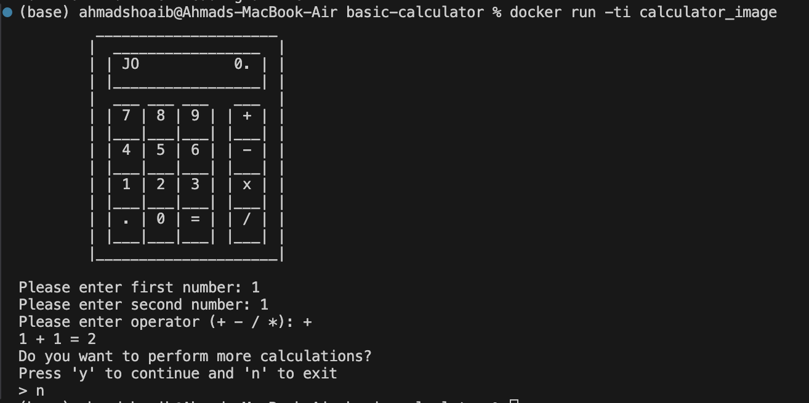

# Basic Python Calculator

Build a basic calculator using python. User docker container to make an image and run the code.

Use following command to build docker:

```
docker build -t calculator_image .
```

Use following command to run docker:

```
docker run -ti calculator_image
```

### How does it looks like



